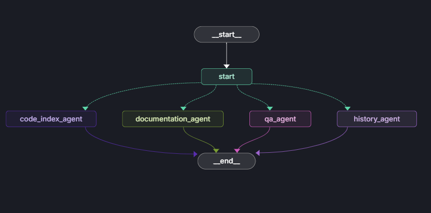

# Git Repository AI Agent - Streamlit Application

A Streamlit-based application for processing Git repositories and interacting with them through an AI agent.

## 📁 Project Structure

```
your_project/
├── src/
    - llm.py
    - prompts.py
    - vector_store_git_loader.py 
├── app.py                      # Streamlit interface    
├── requirements.txt            # Python dependencies
├── chroma_db/                  # ChromaDB storage (created automatically)
└── cloned_repo/                # Cloned repositories (created automatically)
```


## Architecture



## 🚀 Installation

1. **Install dependencies:**

```bash
pip install streamlit
pip install langchain
pip install langchain-community
pip install langgraph
pip install sentence-transformers
pip install langchain-groq
pip install chromadb
pip install GitPython
pip install numpy
```

Or create a `requirements.txt`:

```txt
streamlit>=1.28.0
langchain>=0.1.0
langchain-community>=0.0.10
sentence-transformers>=2.2.2
chromadb>=0.4.18
GitPython>=3.1.40
numpy>=1.24.0
```

Then install:
```bash
pip install -r requirements.txt
```

## 📝 Setup Steps

### 1. Save the Core Module

Save the core processing logic as `vector_store_git_loader.py`

### 2. Save the Streamlit App

Save the Streamlit interface as `app.py`

### 3. Integrate Your Agent

Create a file called `llm.py` (or use your existing llm file) with your `agent_build()` function:

```python
# your_agent_module.py
from langgraph.graph import StateGraph
# ... your other imports

def agent_build():
    """
    Build and return your agent graph
    Returns: Compiled LangGraph agent
    """
    # Your agent implementation here
    graph = StateGraph(...)
    # ... your agent setup
    return graph.compile()
```

### 4. Update app.py to Use Your Agent

In `app.py`, find these two sections and uncomment/modify them:

**Section 1** (around line 180 - Agent Initialization):
```python
# Find this in render_process_tab():
update_status_callback("🤖 Initializing AI Agent...")
try:
    # Uncomment these lines:
    from your_agent_module import agent_build
    st.session_state.agent_graph = agent_build()
    
    # Comment out or remove this placeholder:
    # st.session_state.agent_graph = "agent_initialized"
    
    update_status_callback("✅ AI Agent initialized successfully!")
except Exception as agent_error:
    update_status_callback(f"⚠️ Agent initialization: {str(agent_error)}")
```

**Section 2** (around line 290 - Agent Invocation):
```python
# Find this in render_chat_tab():
if st.session_state.agent_graph:
    with st.spinner("🤔 Agent is thinking..."):
        # Uncomment these lines:
        response = st.session_state.agent_graph.invoke({
            "messages": st.session_state.conversation_messages,
            "conversation_history": st.session_state.conversation_messages
        })
        
        last_message = response["messages"][-1]
        answer = last_message.content if hasattr(last_message, "content") else last_message["content"]
        
        # Remove the placeholder response code
```

## 🏃 Running the Application

1. **Start the Streamlit app:**

```bash
streamlit run app.py
```

2. **The app will open in your browser at `http://localhost:8501`**

## 📖 Usage Guide

### Step 1: Process Repository

1. Navigate to the **"Process Repository"** tab
2. Configure the repository URL and local path in the sidebar (or use defaults)
3. Click **"Start Processing"** button
4. Watch the progress bar and log as the system:
   - Loads the embedding model
   - Initializes ChromaDB
   - Clones/updates the repository
   - Loads documents
   - Generates embeddings
   - Stores data in the vector database
   - Initializes the AI agent

### Step 2: Chat with Agent

1. Switch to the **"Chat with Agent"** tab
2. Type your questions in the chat input
3. Use quick question buttons for common queries
4. View responses with full context from your repository

### Features

- **💬 Conversation Memory**: Maintains last 10 messages (5 exchanges)
- **🗑️ Clear Chat**: Reset conversation without reprocessing
- **🔄 Reset All**: Start fresh with new configuration
- **📊 Status Tracking**: Real-time progress updates
- **📋 Processing Log**: Detailed logs of all operations

## 🔧 Configuration

### Adjusting Parameters

Edit these constants in `git_document_processor.py`:

```python
CHROMADB_DIR = "./chroma_db"           # Vector DB storage location
EMBEDDING_MODEL_NAME = "sentence-transformers/all-MiniLM-L6-v2"  # Embedding model
CHUNK_SIZE = 2000                       # Document chunk size
CHUNK_OVERLAP = 500                     # Overlap between chunks
COLLECTION_NAME = "git_documents"       # ChromaDB collection name
```

### Changing Repository

Update in the sidebar or modify defaults in `app.py`:

```python
repo_url = st.text_input(
    "Repository URL",
    value="https://github.com/YOUR_USERNAME/YOUR_REPO.git",  # Change this
    help="Enter the Git repository URL",
    key="repo_url"
)
```

## 🎯 Agent Integration Example

Here's a complete example of how your agent might be structured:

```python
# your_agent_module.py
from typing import TypedDict, Annotated, Sequence
from langchain_core.messages import BaseMessage
from langgraph.graph import StateGraph, END
from langchain_groq import ChatGroq
from src.prompts import (
    get_code_index_agent_messages,
    get_documentation_agent_messages,
    get_qa_agent_messages,
    get_history_agent_messages
)

class AgentState(TypedDict):
    messages: Annotated[Sequence[BaseMessage], "The messages in the conversation"]
    conversation_history: Annotated[list, "The conversation history"]

def agent_build():
    """Build the agent graph with vector store retrieval"""
    
    # Initialize your LLM
    llm = ChatOpenAI(model="gpt-4", temperature=0)
    
    # Create your agent with tools
    # ... your agent setup here
    
    # Define the graph
    workflow = StateGraph(AgentState)
    
    # Add nodes
    workflow.add_node("agent", your_agent_node)
    workflow.add_node("action", your_action_node)
    
    # Define edges
    workflow.set_entry_point("agent")
    workflow.add_conditional_edges(
        "agent",
        should_continue,
        {
            "continue": "action",
            "end": END
        }
    )
    workflow.add_edge("action", "agent")
    
    return workflow.compile()
```

## 🐛 Troubleshooting

### Common Issues

1. **"No module named 'git_document_processor'"**
   - Make sure `vector_store_git_loader.py` is in the same directory as `app.py`
   - Check that you're running from the correct directory

2. **ChromaDB errors**
   - Delete the `chroma_db` folder and reprocess
   - Check disk space and permissions

3. **Git clone fails**
   - Verify the repository URL is correct
   - Check network connection
   - For private repos, configure Git credentials

4. **Agent not responding**
   - Verify `agent_build()` is properly implemented
   - Check that the agent returns the expected response format
   - Look at the error messages in the chat

5. **Memory issues with large repositories**
   - Reduce `CHUNK_SIZE` in configuration
   - Process smaller branches or specific folders
   - Increase system RAM if possible

## 📊 Features Breakdown

### Processing Tab
- ✅ Real-time progress tracking
- ✅ Detailed logging
- ✅ Error handling with rollback
- ✅ Automatic retry logic
- ✅ Status indicators

### Chat Tab
- ✅ Natural conversation flow
- ✅ Message history display
- ✅ Quick action buttons
- ✅ Example questions
- ✅ Error recovery
- ✅ Loading indicators

### Sidebar
- ✅ Configuration controls
- ✅ Status monitoring
- ✅ Document count metrics
- ✅ Conversation management
- ✅ Reset functionality

## 🔐 Security Notes

- Never commit API keys or credentials to the repository
- Use environment variables for sensitive data:

```python
import os
from dotenv import load_dotenv

load_dotenv()
api_key = os.getenv("OPENAI_API_KEY")
```

- For private repositories, set up SSH keys or GitHub tokens

## 📈 Performance Tips

1. **First-time processing**: May take several minutes for large repos
2. **Subsequent runs**: Much faster as it only pulls updates
3. **Query optimization**: Keep queries specific for better results
4. **Memory management**: Clear chat history periodically
5. **Database**: ChromaDB persists data, no need to reprocess unless repo changes

## 🤝 Contributing

To extend this application:

1. **Add new document loaders**: Extend `GitDocument` class
2. **Custom embedding models**: Modify `EmbeddingManager`
3. **Different vector stores**: Replace `VectorStoreManager`
4. **Enhanced UI**: Customize Streamlit components
5. **Advanced agents**: Implement complex agent architectures

## 📚 Additional Resources

- [Streamlit Documentation](https://docs.streamlit.io/)
- [LangChain Documentation](https://python.langchain.com/)
- [ChromaDB Documentation](https://docs.trychroma.com/)
- [Sentence Transformers](https://www.sbert.net/)
- [LangGraph Documentation](https://langchain-ai.github.io/langgraph/)

## 📄 License

This project is provided as-is for educational and commercial use.

---

**Happy Coding! 🚀**

For issues or questions, please refer to the documentation or create an issue in your repository.